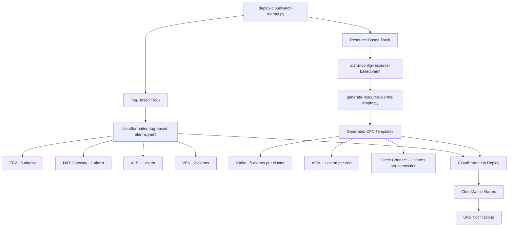

# Design Document: Restructure CloudWatch Alarms

## Overview

This design restructures the CloudWatch alarms project to match the 海平观测Metric.xlsx requirements. The project maintains its existing dual-approach architecture (tag-based and resource-based alarms) but with a reduced, focused set of services and exactly one alarm per metric.

**Tag-based services** (4): EC2, NAT Gateway, ALB, VPN — these use CloudWatch Metrics Insights SQL with tag filtering in a single CloudFormation template.

**Resource-based services** (3): Kafka (MSK), ACM, Direct Connect — these use per-resource alarm definitions generated from a YAML config file.

Key changes:
- Remove 8 services (Redis, RDS, EFS, OpenSearch, RabbitMQ, WAF, DocumentDB, EKS EC2)
- Add 4 services (NAT Gateway, VPN, ACM, Direct Connect)
- Move ALB from resource-based to tag-based
- Trim EC2 and Kafka to Excel-specified metrics only
- Enforce one alarm per metric (no severity tiers)
- Add CWAgent namespace support for EC2 memory/disk/inode metrics
- Add metric math expression support for Kafka memory and Direct Connect bandwidth

## Architecture

The architecture remains the same two-track approach, but with updated service assignments:



**Total alarm count**: 10 tag-based + (5 × kafka_clusters + 1 × acm_certs + 3 × dx_connections) resource-based.

## Components and Interfaces

### 1. Tag-Based Template (`cloudformation-tag-based-alarms.yaml`)

Complete rewrite. Contains exactly 10 alarm resources:

| Service | Metric | Namespace | Threshold | Operator |
|---------|--------|-----------|-----------|----------|
| EC2 | CPUUtilization | AWS/EC2 | 90 | GreaterThanThreshold |
| EC2 | mem_used_percent | CWAgent | 90 | GreaterThanThreshold |
| EC2 | disk_used_percent | CWAgent | 90 | GreaterThanThreshold |
| EC2 | disk_inodes_used_percent | CWAgent | 90 | GreaterThanThreshold |
| EC2 | StatusCheckFailed_System | AWS/EC2 | 1 | GreaterThanOrEqualToThreshold |
| EC2 | StatusCheckFailed | AWS/EC2 | 1 | GreaterThanOrEqualToThreshold |
| NAT | ErrorPortAllocation | AWS/NATGateway | 100 | GreaterThanThreshold |
| ALB | UnHealthyHostCount | AWS/ApplicationELB | 1 | GreaterThanOrEqualToThreshold |
| VPN | TunnelState (connection) | AWS/VPN | 1 | LessThanThreshold |
| VPN | TunnelState (tunnel) | AWS/VPN | 1 | LessThanThreshold |

Parameters: `TagKey`, `TagValue`, `SNSTopicArn` (unchanged).

Each alarm uses Metrics Insights SQL:
```sql
SELECT MAX(MetricName) FROM "Namespace" WHERE tag.${TagKey} = '${TagValue}' GROUP BY DimensionName ORDER BY MAX() DESC
```

For CWAgent metrics, the namespace changes to `"CWAgent"` and GROUP BY uses `InstanceId`.

For VPN tunnel-level alarm, the SQL groups by both `VpnId` and `TunnelIpAddress`.

### 2. Resource-Based Config (`alarm-config-resource-based.yaml`)

Complete rewrite with 3 services. New features needed:
- `math_expression` field for computed metrics (Kafka memory, DX bandwidth)
- `extra_dimensions` for multi-dimension metrics (Kafka MaxOffsetLag)
- `bandwidth_parameter` flag for DX bandwidth alarms

```yaml
services:
  kafka:
    name: MSK (Kafka)
    namespace: AWS/Kafka
    dimension_name: Cluster Name
    alarms:
      - metric: MaxOffsetLag
        threshold: 200000
        operator: GreaterThanThreshold
        extra_dimensions: ["Consumer Group", "Topic"]
      - metric: CpuUser
        threshold: 90
        operator: GreaterThanThreshold
        extra_dimensions: ["Broker ID"]
      - metric: MemoryPercent
        math_expression: "m1/(m1+m2)*100"
        math_metrics:
          m1: MemoryUsed
          m2: MemoryFree
        threshold: 90
        operator: GreaterThanThreshold
        extra_dimensions: ["Broker ID"]
      - metric: KafkaDataLogsDiskUsed
        threshold: 75
        operator: GreaterThanThreshold
        extra_dimensions: ["Broker ID"]
      - metric: ActiveControllerCount
        threshold: 1
        operator: LessThanThreshold

  acm:
    name: ACM
    namespace: AWS/CertificateManager
    dimension_name: CertificateArn
    alarms:
      - metric: DaysToExpiry
        threshold: 30
        operator: LessThanOrEqualToThreshold

  directconnect:
    name: Direct Connect
    namespace: AWS/DX
    dimension_name: ConnectionId
    alarms:
      - metric: ConnectionState
        threshold: 1
        operator: LessThanThreshold
      - metric: IngressBandwidthPercent
        math_expression: "m1/bandwidth*100"
        math_metrics:
          m1: ConnectionBpsIngress
        threshold: 90
        operator: GreaterThanThreshold
        bandwidth_parameter: true
      - metric: EgressBandwidthPercent
        math_expression: "m1/bandwidth*100"
        math_metrics:
          m1: ConnectionBpsEgress
        threshold: 90
        operator: GreaterThanThreshold
        bandwidth_parameter: true
```

### 3. Template Generator (`generate-resource-alarms-simple.py`)

Updated to handle:
- New service choices: `kafka`, `acm`, `directconnect`
- Math expressions: when `math_expression` is present, generate CloudFormation `Metrics` array with multiple metric IDs and an expression metric
- Bandwidth parameter: accept `--bandwidth` CLI argument for DX percentage calculations
- Extra dimensions: handle multi-dimension alarm configurations

For math expression alarms, the generated CloudFormation uses:
```yaml
Metrics:
  - Id: m1
    MetricStat:
      Metric:
        Namespace: AWS/Kafka
        MetricName: MemoryUsed
        Dimensions:
          - Name: Cluster Name
            Value: cluster-name
          - Name: Broker ID
            Value: broker-id
      Period: 300
      Stat: Maximum
  - Id: m2
    MetricStat:
      Metric:
        Namespace: AWS/Kafka
        MetricName: MemoryFree
        Dimensions:
          - Name: Cluster Name
            Value: cluster-name
          - Name: Broker ID
            Value: broker-id
      Period: 300
      Stat: Maximum
  - Id: result
    Expression: "m1/(m1+m2)*100"
    ReturnData: true
```

### 4. Deployment Script (`deploy-cloudwatch-alarms.py`)

Updated constants and discovery:
```python
TAG_BASED_SERVICES = ['ec2', 'nat-gateway', 'alb', 'vpn']
RESOURCE_BASED_SERVICES = ['kafka', 'acm', 'directconnect']
```

New discovery functions:
- `discover_acm_certificates(region, tag_key, tag_value)` — uses `boto3.client('acm')` to list and filter certificates by tags
- `discover_dx_connections(region, tag_key, tag_value)` — uses `boto3.client('directconnect')` to list and filter connections by tags

Removed:
- EKS cluster discovery and deployment
- All references to removed services
- `validate_prerequisites` check for `cloudformation-eks-ec2-alarms.yaml` and `generate-resource-based-template.py`

### 5. Files to Delete

| File | Reason |
|------|--------|
| `cloudformation-eks-ec2-alarms.yaml` | EKS EC2 not in Excel |
| `cloudformation-opensearch-alarms-generated.yaml` | OpenSearch not in Excel |
| `cloudformation-docdb-alarms-generated.yaml` | DocumentDB not in Excel |
| `cloudformation-rabbitmq-alarms-generated.yaml` | RabbitMQ not in Excel |
| `cloudformation-waf-alarms-generated.yaml` | WAF not in Excel |
| `cloudformation-alb-alarms-generated.yaml` | ALB moved to tag-based |
| `cloudformation-kafka-alarms-generated.yaml` | Will be regenerated |
| `generate-resource-based-template.py` | Legacy CDK-based generator |
| `check_resources.py` | No longer needed |

## Data Models

### Tag-Based Alarm Resource (CloudFormation)

Each alarm in the tag-based template follows this structure:

```yaml
AlarmLogicalId:
  Type: AWS::CloudWatch::Alarm
  Properties:
    AlarmName: !Sub "${TagValue}-Service-MetricName"
    AlarmDescription: Description in Chinese
    Metrics:
      - Id: m1
        ReturnData: true
        Expression: !Sub >-
          SELECT MAX(MetricName) FROM "Namespace"
          WHERE tag.${TagKey} = '${TagValue}'
          GROUP BY DimensionName ORDER BY MAX() DESC
        Period: 300
    Threshold: <number>
    ComparisonOperator: <operator>
    EvaluationPeriods: 2
    TreatMissingData: notBreaching
    AlarmActions:
      - !Ref SNSTopicArn
```

### Resource-Based Alarm Config Entry

```yaml
metric: MetricName           # CloudWatch metric name
threshold: <number>          # Alarm threshold
operator: <CW operator>     # ComparisonOperator value
description: <string>       # Chinese description
extra_dimensions: [list]    # Optional additional dimensions
math_expression: <string>   # Optional math expression
math_metrics:               # Optional metric ID mappings
  m1: MetricName1
  m2: MetricName2
bandwidth_parameter: bool   # Optional flag for DX bandwidth
```

### Deployment Script Service Config

```python
@dataclass
class ServiceConfig:
    name: str
    service_type: str  # 'tag-based' or 'resource-based'
    alarm_count: int   # Expected alarms per deployment
```


## Correctness Properties

*A property is a characteristic or behavior that should hold true across all valid executions of a system — essentially, a formal statement about what the system should do. Properties serve as the bridge between human-readable specifications and machine-verifiable correctness guarantees.*

Based on the prework analysis, the following properties were identified. Many acceptance criteria are specific example checks (verifying a particular alarm exists with a particular threshold), but several universal properties emerge:

Property 1: Tag-based template namespace allowlist
*For any* alarm resource in the tag-based CloudFormation template, the Metrics Insights SQL expression SHALL reference only one of the allowed namespaces: `AWS/EC2`, `CWAgent`, `AWS/NATGateway`, `AWS/ApplicationELB`, or `AWS/VPN`.
**Validates: Requirements 1.2**

Property 2: No removed service references in deployment script
*For any* line in the deployment script source code, the line SHALL not contain references to removed service identifiers: `eks`, `redis`, `rds`, `efs`, `opensearch`, `rabbitmq`, `waf`, or `docdb` (excluding comments).
**Validates: Requirements 10.4**

Property 3: Math expression template generation
*For any* alarm config entry that contains a `math_expression` field, the Template_Generator SHALL produce a CloudFormation alarm resource with multiple `MetricStat` entries for each metric in `math_metrics` and an `Expression` entry for the computed result.
**Validates: Requirements 11.2**

Property 4: One alarm per metric in tag-based template
*For any* pair of alarm resources in the tag-based template, if they monitor the same metric name from the same namespace, they SHALL be the same resource (no duplicates).
**Validates: Requirements 14.1**

Property 5: One alarm per metric in resource-based config
*For any* service in the resource-based config, no two alarm entries SHALL share the same `metric` name.
**Validates: Requirements 14.2**

## Error Handling

| Scenario | Handling |
|----------|----------|
| CWAgent not installed on EC2 | Alarms use `TreatMissingData: notBreaching` — no false alarms |
| No resources found for a service during discovery | Deployment script logs a message and skips the service |
| CloudFormation template exceeds 51KB | Upload to S3 and use `TemplateURL` (existing behavior) |
| Math expression metric missing data | `TreatMissingData: notBreaching` prevents false alarms |
| Direct Connect bandwidth parameter not provided | Template generator requires `--bandwidth` flag, exits with error if missing for DX service |
| ACM certificate has no DaysToExpiry metric | Newly issued certs may not emit this metric immediately; `TreatMissingData: notBreaching` handles this |

## Testing Strategy

### Unit Tests (Example-Based)

Verify specific alarm configurations exist with correct values:
- Parse `cloudformation-tag-based-alarms.yaml` and verify each of the 10 expected alarms exists with correct namespace, metric, threshold, and operator
- Parse `alarm-config-resource-based.yaml` and verify each service has the correct alarm definitions
- Verify the deployment script constants (`TAG_BASED_SERVICES`, `RESOURCE_BASED_SERVICES`) contain exactly the expected values
- Verify obsolete files are deleted

### Property-Based Tests

Use `hypothesis` (Python) for property-based testing with minimum 100 iterations per property.

- **Property 1**: Parse the tag-based template, extract all Expression fields, verify each references only allowed namespaces
- **Property 2**: Parse the deployment script, verify no removed service identifiers appear in non-comment lines
- **Property 3**: Generate alarm configs with random math_expression entries, run the template generator, verify output structure
- **Property 4**: Parse the tag-based template, extract (namespace, metric) pairs, verify uniqueness
- **Property 5**: Parse the resource-based config, for each service extract metric names, verify uniqueness

Tag format: **Feature: restructure-cloudwatch-alarms, Property N: property_text**

### CloudFormation Validation

Use the `aws-infrastructure-as-code` Kiro Power to:
- Validate the rewritten `cloudformation-tag-based-alarms.yaml` with cfn-lint
- Validate generated resource-based templates with cfn-lint
- Check security compliance with cfn-guard
